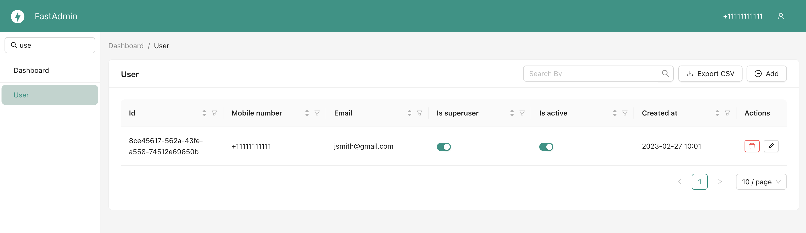
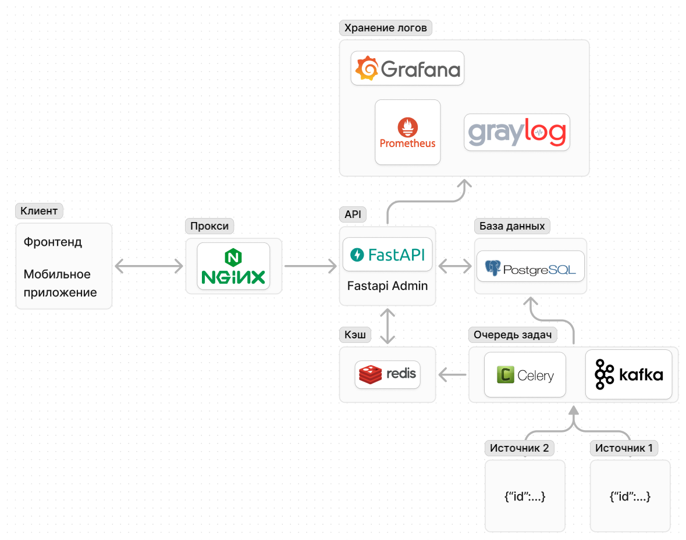

# Тестовое задание от Татнефть Цифровые Технологии
## Задание 1.
Дано: число N
Требуется: Написать функцию, возвращающую все простые числа до N 

<b>Решение:</b> 
Стандартный алгоритм: решето Эратосфера 

1. Выписать подряд все целые числа от двух до n (2, 3, 4, …, n).
2. Пусть переменная p изначально равна двум — первому простому числу.
3. Зачеркнуть в списке числа от 2p до n, считая шагами по p (это будут числа, кратные p: 2p, 3p, 4p, …).
4. Найти первое незачёркнутое число в списке, большее чем p, и присвоить значению переменной p это число.
5. Повторять шаги 3 и 4, пока возможно.

[Решение](task_1/task_1.py)

## Задание 2.
Дано: список, содержащий URL страниц
Требуется: Написать функцию, которая получает из Сети код страниц из списка и сохраняет его (код) на диск.

Решение:
Можно решить несколькими способами:
1. Последовательно делать запрос на url
2. Отправлять запросы на сайты в пуле потоков
3. асинхронно отправлять запросы на сайты и сохранять код (не дожидаясь ответа на один url посылаем запрос на другой)

[Решение](task_2/task_2.py)

## Задание 3
### Примерный список инструментов и библиотек для реализации сервера-посредника:
1. Сервер-посредник (библиотеки и фреймворки):
    - __FastAPI__ для реализации api
    - __SQLAlchemy__ и __psycopg__ для обращения к СУБД PostgreSQL
    - __redis__ для обращения к кэшу
    - __pygelf__ для экспорта логов в graylog
    - __FastAdmin__ для реализации админки
    - __uvicorn__ для запуска веб-сервера
3. __PostgreSQL__ для базы данных
2. __Redis__ для кэширования
3. Хранение и визуализация логов:
   - __Graylog__ для сбора и визуализации логов работы приложения;
   - __Prometheus__ (и экспортеры) для сбора и хранения состояния железа (cpu, ram, rom и т.д.);
   - __Grafana__ для визуализации состояния железа;
4. Получение и обновление данных:
    - __Celery__ для периодического опроса источников и объединения данных (если сервис должен сам опрашивать на наличие свежей информации)
    - Или __Kafka__ + воркер, читающий сообщения об обновлении информации (если источники сами присылают актуальную информацию)
5. __Nginx__ для обратного прокси + https. Если возникнет необходимость масштабировать сервис, то можно использовать как балансировщик нагрузки
6. __Docker__ - развертывание микросервисов на серверах;

### Эндпоинты на API:
- GET /auth - аутентификация на сервере-посреднике. Возврат токена доступа (access, refresh)
- GET /gas_stations - получение списка АЗС
- GET /gas_stations/{id} - Получение информации о АЗС по id

__Админ-панель:__
- GET /admin - панель администратора с аутентификацией через /auth
- PUT /gas_stations/{id} - обновление данных АЗС (названия топлива, иконки)
- DELETE /gas_stations/{id} - Удаление данных АЗС по id

### Алгоритм работы сервиса:

__Обновление данных:__
1. Воркеры celery периодически опрашивают / источники присылают данные через брокер;
2. Данные парсятся, объединяются по id заправочной станции;
3. Обновляется сначала кэш. По id проверяется наличие записи в кэше. При наличии записи данные в кэше обновляются. Это необходимо, чтобы клиент получил актуальную информацию из кэша
4. После обновления кэша данные обновляются и в БД;
5. *также устанавливаются дефолтные иконки при их отсутствии (ссылки на картинки к каждому виду топлива)
6. **Все этапы логировать в graylog для отслеживания ошибок.

__Получение данных по запросу клиента:__
1. Клиент делает запрос на /get_station/{id}, где id - идентификатор АЗС;
2. API принимает запрос, по id проверяет, есть ли запись в кэше Redis;
3. - Если запись есть, то получает запись из кэша;
   - Если записи нет, делает запрос в базу данных, получает запись и кэширует её в Redis
5. Возвращает клиенту json
6. *Логирование всех запросов в graylog

__Администирование:__
1. Аутентификация в админ панели;
2. Запрос списка станций/конкретной станции
3. Обновление данных (название топлива, иконки). В БД обновляются ссылки на иконки, добавляется/обновляется поле с названием топлива для клиента

### Общая схема сервиса

__[Ссылка на схему в Figma](https://www.figma.com/board/cI0WJnxNH2Y0UqNBuuCuli/%D0%90%D1%80%D1%85%D0%B8%D1%82%D0%B5%D0%BA%D1%82%D1%83%D1%80%D0%B0-API?node-id=0-1&t=YnA63EQrN19yWw6j-1)__

# Спасибо за внимание!
